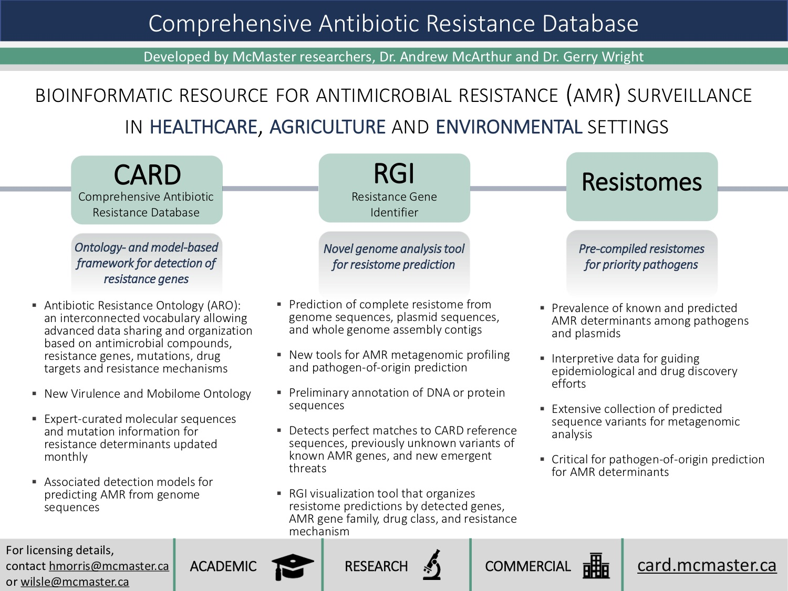

# RU-Spring-2018
# Molecular View of Human Anatomy: Molecular Mechanisms of Antibiotics Action and Resistance and the [Comprehensive Antibiotic Resistance Database](http://card.mcmaster.ca)
 
## Overview 

The Comprehensive Antibiotic Resistance Database (CARD) is a bioinformatics resource for antimicrobial resistance genes, their products and associated phenotypes. With a focus on the molecular determinants of AMR, CARD is heavily used for molecular surveillance of AMR in the environment, agriculture, and clinic:

## Lab Goals

The goals of this laboratory is to introduce students to the diversity of molecular mechanisms underlying AMR, provide a practical exposure of databases and biocuration, illustrate the power of ontologies for organizing complex biomedical information, and provide practical skills in annotation of clinical genome sequences. All analyses will be performed online at http://card.mcmaster.ca

## Antibiotic Resistance Ontology

At the heart of the Comprehensive Antibiotic Resistance Database is the Antibiotic Resistance Ontology (ARO), a controlled vocabulary for organizing and cross-linking diverse data within CARD.

> Question #1. Browsing from the CARD home page, what are the seven major branches of the ARO?

> Question #2. How many major drug classes are represented in the ARO? These are tagged as [Drug Class] within the ARO.

> Question #3. Using the search box, find the ARO term for the MCR-1 protein. Outline what drugs MCR-1 confers resistance to and via which mechanism. Explain the mechanism by exploring the ARO terms associated with MCR-1.

## Detection Models & the Resistance Gene Identifier

Continuing to look at CARD’s entry for MCR-1, you’ll see that ARO terms describing specific genes include curated Detection Models, which define the parameter and sequence space needed to predict presence of AMR genes in raw genome or metagenome samples. CARD’s collection of Detection Models are used by the Resistance Gene Identifier software (RGI) to annotate genomes, with all results categorized using terms in the ARO.

> Question #4. Again using the search box, contrast MCR-1 and *Mycobacterium tuberculosis* embB mutations conferring resistance to ethambutol. How does the mechanism of resistance differ between these two genes? What extra information is required in the embB detection model? 

> Question #5. Using the Resistance Gene Identifier software, analyze plasmid HQ451074.1. Perfect = perfect matches to reference sequences in the CARD, Strict = allowable variants of the reference sequences in the CARD using curated cut-offs, Loose = sequences with similarity to CARD reference sequences, but outside of detection model cut-offs. Trying the RGI visualizations and table view, which are all based on the ARO, and only using Perfect and Strict hits, what resistance genes or variants exist in this plasmid sequence, which drugs classes do they confer resistance to, and via which mechanisms?

> Question #6. Using the Resistance Gene Identifier software, analyze genome AE014613.1 from *Salmonella enterica*. Which mutation-based antimicrobial resistance is present in this genome, i.e. which genes and effected drugs? Are any of these detected mutations from the same pathogen? Do you think this pathogen will be resistant to these drugs? 

## Super Bugs

We have only two drug classes of ‘last resort’, which we only use in extreme circumstances. These are colistin and fourth-generation carbapenems. In that last 10 years, two genes have emerged that cause resistance to these drugs: MCR proteins against colistin, NDM proteins against fourth-generation carbapenems.

> Question #7. CARD routinely analyzes the thousands of genomes, plasmids, and whole genome shotgun assemblies available in GenBank. Using CARD’s “Resistomes & Variants” section, can you find a pathogen with both of these genes? Which pathogen contains these genes and how many drug classes can it resist? Would you consider this a super bug?

## Clinical Samples

At McMaster University and in association with our regional hospitals, we have a AMR surveillance program where any infection reported resistant to 3 or more drugs is isolated, cultured, screened for resistance to a panel of 18 antibiotics, has its genome sequenced, and full resistome predicted by the RGI. We are sharing data from two of these isolates to you as a challenge to predict the mechanisms of resistance.

> Question #8. Sample #1 has been identified as a vancomycin resistant *Enterococcus*, but the exact species identification is uncertain. Using the RGI using Perfect & Strict, explain the underlying mechanism for the observed vancomycin resistance. What is the genetic underpinning for this mechanism?

Sample #2 has proven to be a difficult analysis that illustrates the limits of sequence-based analysis. Specifically, it has strong aminoglycoside resistance and we suspect RGI is under-predicting aminoglycoside resistance genes. Explore the RGI results for this gene using Perfect, Strict, and Loose. 

> Question #9. Which aminoglycoside genes are predicted as Perfect or Strict?

> Question #10. The CARD website cannot visualize all of the Loose hits, but if you sort the Table View by “ARO Term” you will see three Loose hits to AAC(6') genes. Use the “Download All” button and open the “*.txt” file in EXCEL to find the “Predicted_Protein” sequences for these three entries. Use the [PDB Sequence Search tool](http://www.rcsb.org/pages/search_features#search_sequences) to analyze these sequences against known structures. Do you think any of these three genes are functional AAC(6') genes? If so, why do you think these sequences are in not in CARD?

# Curation Challenge

Below is a list of papers discovered in the last few weeks by CARD’s text mining tool CARD:Shark. CARD:Shark examines the PubMed resource every 30 days and scores papers on their likelihood to contain information important for CARD. We also use it to back-scan the literature for resistance in specific pathogens. There can be more than 1000 AMR papers published each month, more than our curation team can screen manually, but CARD*Shark ‘shuffles the deck’ and puts the most valuable papers at the top of our curation que. 

**CARD:Shark Highlighted Papers**

* Leeds JA, *et al.* 2014. *J. Antimicrob. Chemother.* 69(1):41-4 *In vitro* selection, via serial passage, of *Clostridium difficile* mutants with reduced susceptibility to fidaxomicin or vancomycin. [PMID 23887866](https://www.ncbi.nlm.nih.gov/pubmed/23887866)

> Question #11. Pick one paper that interests you and decide how it would be added to CARD, specifically what type of Detection Model and where it would connect to the Antibiotic Resistance Ontology?

